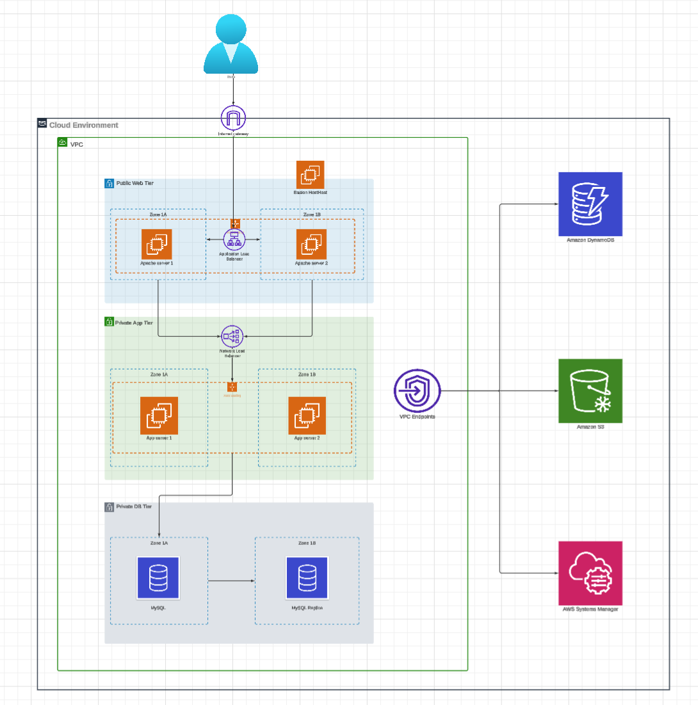

## System Architecture

#AWS 3‑Tier Infrastructure with Terraform & GitHub Actions (CI/CD)

This project provisions a complete 3‑tier AWS infrastructure using Terraform, with a CI/CD pipeline built from three GitHub Actions workflows. The architecture is designed for high availability, multi‑AZ resilience, and Terraform state management using S3 + DynamoDB.

1. Project Purpose
The goal of this project is to demonstrate how I design and operate cloud infrastructure in a way that is:
- Highly available and fault‑tolerant
- Modular and easy to maintain
- Secure by default
- Automated through CI/CD
- Backed by a reliable remote backend (S3 + DynamoDB)
This reflects the type of work I aim to do in CloudOps, SRE, and Platform Engineering roles.

2. Architecture Overview
The system follows a standard 3‑tier architecture with a strong focus on reliability and clear separation of concerns.
High Availability & Multi‑AZ
- All subnets, load balancers, and Auto Scaling Groups run across multiple Availability Zones
- Traffic is distributed across AZs
- Unhealthy instances are replaced automatically
- No single‑AZ dependency
This mirrors how production workloads are typically deployed on AWS.

Network Layer
- VPC with public and private subnets
- Internet Gateway + NAT Gateway
- Route tables per subnet group
- Multi‑AZ subnet design
Load Balancing Layer
- Application Load Balancer (ALB) for the Web tier
- Network Load Balancer (NLB) for the App tier
- Independent health checks for each tier
Compute Layer
- Auto Scaling Groups for Web and App
- EC2 instances bootstrapped via user‑data
- Multi‑AZ deployment for resilience
Security
- Strict Security Group segmentation
- Tier‑to‑tier traffic only
- Minimal outbound rules
- No broad or open access

3. Terraform State Management (S3 + DynamoDB)
The project uses a remote backend to ensure safe, consistent, and collaborative Terraform operations.
S3 Bucket
- Stores the Terraform state file
- Versioning enabled
- Server‑side encryption
DynamoDB Table
- Provides state locking
- Prevents concurrent terraform apply
- Eliminates race conditions in CI/CD
This setup is aligned with real‑world production environments.

4. Technologies Used
|  |  | 
|  |  | 
|  |  | 
|  |  | 
|  |  | 
|  |  | 
|  |  | 

5. Repository Structure
/modules
   /vpc
   /alb
   /nlb
   /web
   /app
   /asg
   /sg

/environments
   /dev
   /prod

/.github/workflows
   terraform-ci.yml
   terraform-apply.yml
   terraform-destroy.yml

README.md

6. CI/CD Pipeline (3 Workflow Files)
The project uses three separate GitHub Actions workflows, each with a clear responsibility.
6.1 terraform-ci.yml
Runs automatically on every push or pull request.
- terraform fmt
- terraform validate
- terraform init
- terraform plan
Ensures every change is tested and validated before deployment.
6.2 terraform-apply.yml
Triggered manually when deploying changes.
- terraform apply
- Uses the remote backend (S3 + DynamoDB)
- Ensures controlled, predictable, and auditable deployments
6.3 terraform-destroy.yml
Manual workflow for tearing down environments.
- terraform destroy
- Useful for cleanup or temporary environments

7. Deployment Guide
Clone the repository
git clone https://github.com/huynhtung98/eh01-aws-terraform-cicd

Navigate to an environment
cd environments/dev

Deploy
terraform init
terraform apply

8. Key Learnings
Through this project, I strengthened my skills in:
- Designing high‑availability, multi‑AZ AWS architectures
- Structuring Terraform modules for clarity and reusability
- Implementing CI/CD pipelines for IaC
- Managing Terraform state with S3 + DynamoDB
- Debugging module dependencies and variable wiring
- Applying CloudOps/SRE principles in real infrastructure

9. Why This Project Matters
This project reflects how I approach CloudOps/SRE work:
- Infrastructure is highly available, fault‑tolerant, and multi‑AZ
- Terraform is modular, predictable, and easy to maintain
- CI/CD ensures safe and repeatable deployments
- Remote backend ensures state consistency and team collaboration
- Security is built into every layer
- Architecture follows production‑grade patterns
